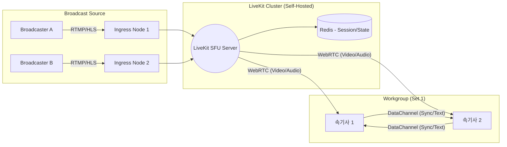

속기사들의 실시간 협업을 위한 **LiveKit 기반 초저지연 영상 동기화 시스템** 개발 계획 및 아키텍처 설계 초안입니다.

---

# [설계안] 초저지연 실시간 자막 제작 협업 시스템 (WebRTC 기반)

## 1. 개요

* **목적**: 원격지 속기사 간의 영상/음성 싱크 오차를 최소화(200ms 미만)하여 자막 제작 효율성 극대화.
* **핵심 기술**: LiveKit SFU, LiveKit Ingress, WebRTC DataChannel.
* **대상**: 100개 채널(세트), 채널당 2~3명의 속기사 협업.

---

## 2. 시스템 아키텍처 (Architecture)

### 2.1 전체 데이터 흐름

1. **Source**: 방송사 송출 신호 (RTMP 또는 HLS)
2. **Ingress Layer**: `LiveKit Ingress`가 소스를 수신 및 WebRTC로 트랜스코딩.
3. **Signal Layer**: `LiveKit Server`가 룸 세션 및 권한 관리.
4. **Client Layer**: 속기사 브라우저(Web SDK)가 영상 수신 및 작업 데이터 공유.

### 2.2 인프라 구성도



---

## 3. 개발 주요 단계 (Roadmap)

### Phase 1: 기반 인프라 구축 (Self-Hosting)

* **LiveKit Server 설치**: Docker Compose 혹은 Kubernetes를 통한 분산 환경 구성.
* **Ingress 서비스 설정**: RTMP 입력을 처리할 전용 인스턴스 확보.
* **인증 로직 구현**: 속기사별 룸 접근 권한(JWT Token) 발급 서버 개발.

### Phase 2: 송출 및 수신 모듈 개발

* **Ingress 연동**: 방송 소스 URL을 매핑하여 특정 `Room`에 자동 입장시키는 로직.
* **Frontend 플레이어**: `livekit-client` SDK를 활용한 초저지연 플레이어 UI 구현.
* **최적화**: 속기용 저해상도/저비트레이트 설정(720p, 1.5Mbps) 적용.

### Phase 3: 협업 기능 개발 (DataChannel)

* **실시간 커서 공유**: 상대방이 타이핑 중인 문구 및 위치 실시간 표시.
* **교대 시스템**: "교대 요청/승인" 이벤트를 DataChannel로 전송하여 딜레이 없는 협업.
* **상태 동기화**: 한 명이 영상을 일시정지하거나 특정 구간 탐색 시 모두에게 동기화(옵션).

---

## 4. 상세 기술 사양 (Technical Spec)

### 4.1 Ingress 최적화 설정

100세트의 부하를 견디기 위해 인코딩 부하를 최소화합니다.

```yaml
# LiveKit Ingress Preset (Example)
video:
  preset: H264_720P_30FPS_3_LAYERS # SVC 지원으로 네트워크 환경 대응
  bitrate: 1500000 # 1.5Mbps 제한
audio:
  preset: OPUS_STEREO_96KBPS

```

### 4.2 하드웨어 요구사항 (100세트 기준 예상)

| 구분 | 사양 | 역할 |
| --- | --- | --- |
| **LK-Controller** | 8 vCPU / 16GB RAM | 세션 관리 및 시그널링 |
| **Ingress-Worker** | 64 vCPU+ (다수 분산) | **핵심 병목**. 채널당 0.5~1 vCPU 할당 필요 |
| **Network** | 1Gbps 이상 대역폭 | 실시간 패킷 전송용 |

---

## 5. 예상 챌린지 및 해결 방안

* **CPU 부하**: 100개 채널 동시 트랜스코딩은 단일 서버로 불가. -> **Ingress Node를 수평 확장(Horizontal Scaling)**하고 Load Balancer로 분산.
* **네트워크 불안정**: UDP 패킷 손실 시 화질 저하. -> LiveKit의 **Dynacast** 기능을 활성화하여 개별 속기사의 망 상태에 맞는 해상도 자동 조절.
* **자막 데이터 유실**: 웹소켓 끊김 발생 시. -> DataChannel을 사용하되, 중요 데이터는 Redis에 캐싱하여 재접속 시 복구.

